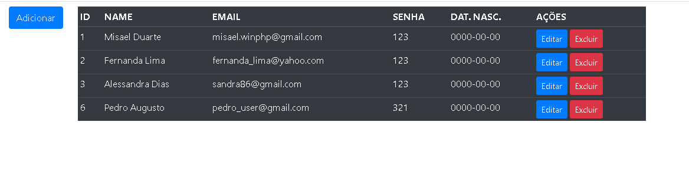

# CRUD

[](https://github/MisaelDuarte/developer/README.md)

[](https://travis-ci.org/joemccann/dillinger)

Um projeto feito em PHP-OO, com objetivo de incluir conceitos  de DAO, SOLID e DATABASE, 
podendo servir para inspiração de novos projetos, criando, lendo, atualizando e deletando dados (CRUD)

CRUD simples, com desenvolvimento em PHP, mostrando a praticidade da orientação a objetos e métodos eficazes para
futuros novos projetos


Tecnologias usadas no projeto:

  - HTML5 && CSS3
  - JAVASCRIPT
  - BOOTSTRAP 4
  - PHP-OO
  - MYSQL
  - GIT


Exemplo do frontend na parte client




### Conexão 

Para conexão ao Banco de Dado, vai precisar do phpMyAdmin (ou outro software que trabalhe com Mysql)

Utilize o PDO para conexão ao banco de dados, vai em config. e altere as variáveis de conexão
```php
$pdo = new PDO("mysql:dbname=$db_name;host=$db_host", $db_user, $db_pass);
```

Este projeto foi realizado sem o uso de alguma dependência em relação ao server, estamos utilizando 
os recursos do XAMPP para executar o código.


### Versão

- XAMPP Control Panel v.3.2.4
- PHP 7.4.5
- Zend Engine v3.4.0


### CRÉDITOS

 - Misael Duarte - Web Developer

Licença
----

[MIT](./LICENSE)


